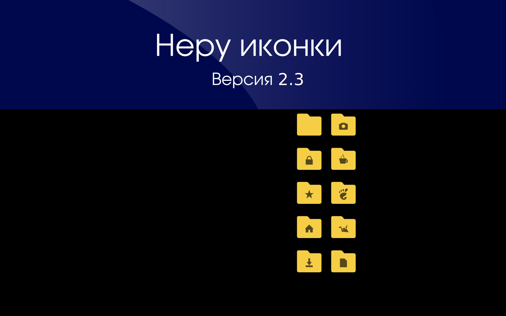

neru-icon-classic-theme
=========================

* Классическая тема иконок Неру для РОСA. Версия 2.0
* Classic theme icons Neru for ROSA. Version 2.0

## Изображение / Image

## Изменения

* Приведена в порядок часть папок малкньких иконок
* Сделаны некоторые правки в index.desktop

## Change

* Added some menu icons 
* Given in the right part of the folder macnica icons
* Made some edits to index.desktop

## Особенности

* Более 3000 иконок
* Подходит для разных окружений KDE4, KDE5 Plasma, Xfce, Gnome, LXQT, Mate и т.д.
* Для тёмных и светлых тем

## Features

* More than 3000 icons
* Suitable for different environments KDE4, KDE5 Plasma, Xfce, Gnome, LXQT, Mate, etc.
* For dark and light themes

## Установка / Installation

`git clone https://github.com/chistota/neru-icon-classic-theme.git /usr/share/icons/`

## Сообщество / Community
* РОСПО Дизайн-студия
* ROSPO Design Studio
* https://vk.com/rospodesign

